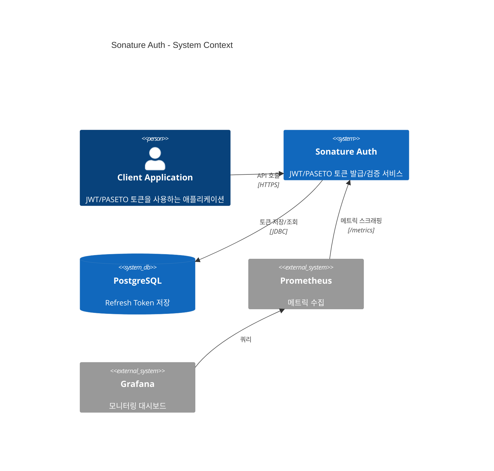
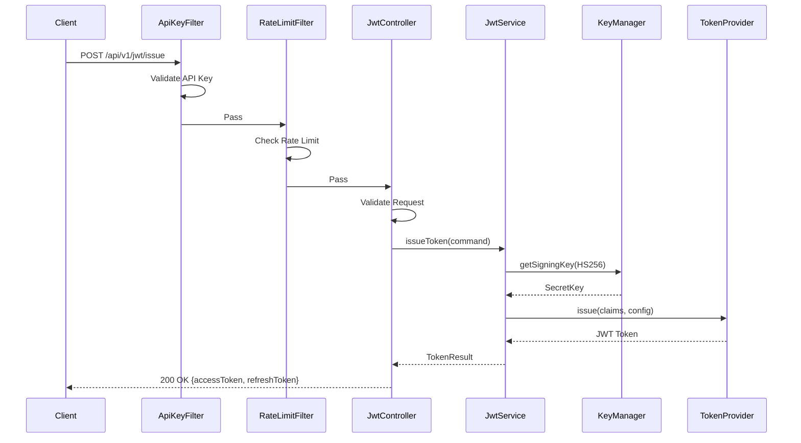
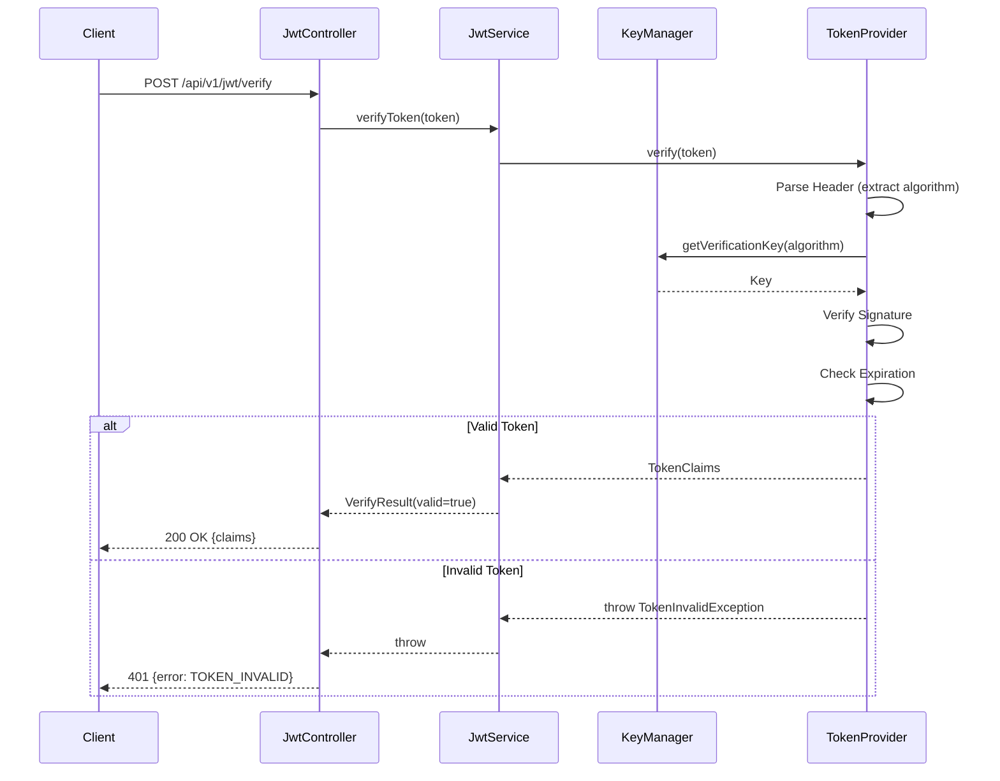
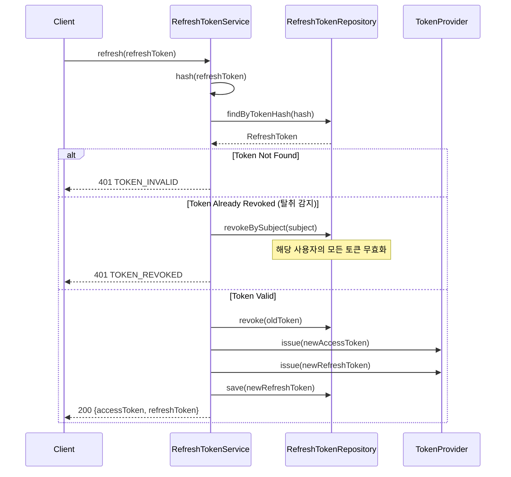
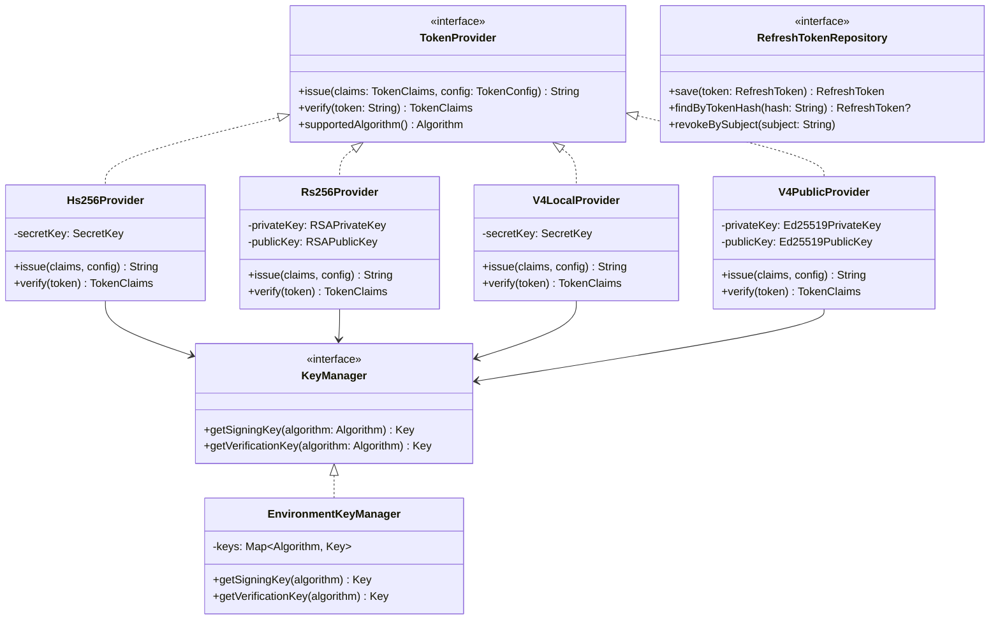
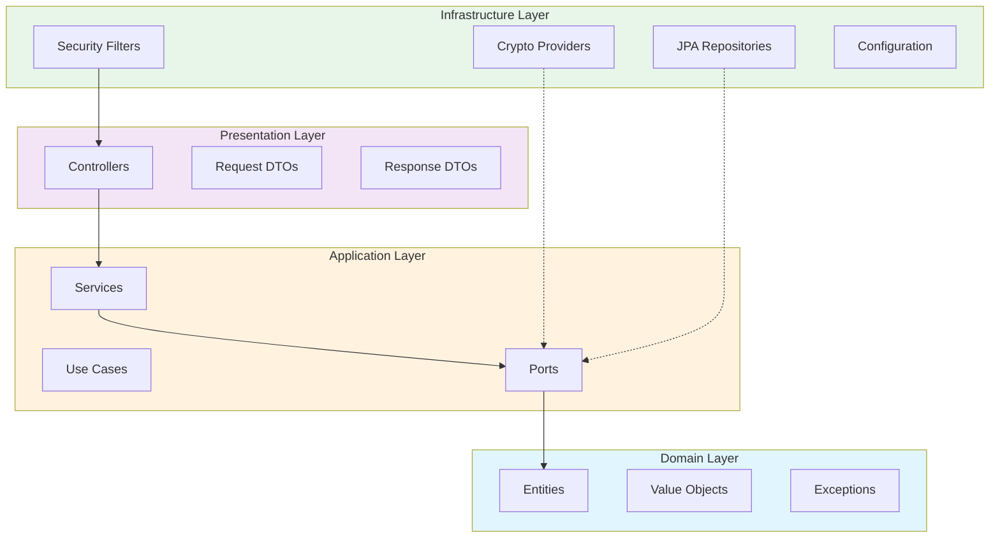

# Architecture

> Sonature Auth 아키텍처 문서

---

## Overview

Clean Architecture 기반 JWT/PASETO 토큰 프레임워크.

```
┌─────────────────────────────────────────────────────────────┐
│                    External Systems                          │
│              (Clients, Monitoring, Database)                 │
└─────────────────────────────────────────────────────────────┘
                              │
┌─────────────────────────────────────────────────────────────┐
│                   Presentation Layer                         │
│            (Controllers, Request/Response DTOs)              │
├─────────────────────────────────────────────────────────────┤
│                   Application Layer                          │
│              (Services, Use Cases, Commands)                 │
├─────────────────────────────────────────────────────────────┤
│                     Domain Layer                             │
│            (Entities, Value Objects, Interfaces)             │
├─────────────────────────────────────────────────────────────┤
│                  Infrastructure Layer                        │
│     (Crypto Providers, Repositories, External Adapters)      │
└─────────────────────────────────────────────────────────────┘
```

---

## Folder Structure

```
src/main/kotlin/com/sonature/auth/
├── SonatureAuthApplication.kt
│
├── domain/                          # [Enterprise Business Rules]
│   ├── token/
│   │   ├── model/                   # Token, TokenClaims, Algorithm
│   │   └── exception/               # TokenExpiredException, etc.
│   ├── key/
│   │   └── model/                   # SigningKey, VerificationKey
│   ├── apikey/
│   │   └── model/                   # ApiKey
│   └── refreshtoken/
│       └── model/                   # RefreshToken (Entity)
│
├── application/                     # [Application Business Rules]
│   ├── port/
│   │   ├── input/                   # Use Cases (JwtIssueUseCase, etc.)
│   │   └── output/                  # TokenProvider, KeyManager, Repository
│   ├── service/                     # JwtService, PasetoService
│   └── dto/                         # Command, Result DTOs
│
├── infrastructure/                  # [Frameworks & Drivers]
│   ├── config/                      # SecurityConfig, JwtConfig
│   ├── persistence/                 # JPA Entity, Repository Adapter
│   ├── crypto/
│   │   ├── jwt/                     # Hs256Provider, Rs256Provider
│   │   └── paseto/                  # V4LocalProvider, V4PublicProvider
│   └── security/                    # ApiKeyFilter, RateLimitFilter
│
├── presentation/                    # [Interface Adapters]
│   ├── api/v1/                      # JwtController, PasetoController
│   └── dto/
│       ├── request/                 # API Request DTOs
│       └── response/                # API Response DTOs
│
└── common/
    ├── util/                        # TimeProvider, IdGenerator
    └── logging/                     # RequestLoggingFilter
```

---

## Core Interfaces

### TokenProvider

토큰 발급/검증을 추상화. 알고리즘별 구현체 교체 가능.

```kotlin
interface TokenProvider {
    fun issue(claims: TokenClaims, config: TokenConfig): String
    fun verify(token: String): TokenClaims
    fun supportedAlgorithm(): Algorithm
}
```

**구현체:**
- `Hs256Provider` - HMAC-SHA256 (대칭키)
- `Rs256Provider` - RSA-SHA256 (비대칭키)
- `V4LocalProvider` - PASETO v4.local (XChaCha20-Poly1305)
- `V4PublicProvider` - PASETO v4.public (Ed25519)

### KeyManager

키 로딩/관리를 추상화. 환경변수, 파일, Vault 등 소스 교체 가능.

```kotlin
interface KeyManager {
    fun getSigningKey(algorithm: Algorithm): Key
    fun getVerificationKey(algorithm: Algorithm): Key
}
```

**구현체:**
- `EnvironmentKeyManager` - 환경변수에서 키 로딩 (MVP)
- `VaultKeyManager` - HashiCorp Vault (향후)

### RefreshTokenRepository

Refresh Token 저장/조회를 추상화.

```kotlin
interface RefreshTokenRepository {
    fun save(token: RefreshToken): RefreshToken
    fun findByTokenHash(hash: String): RefreshToken?
    fun revokeBySubject(subject: String)
}
```

---

## Data Flow

### Token Issue Flow

```
Client Request
     │
     ▼
┌─────────────┐
│ Controller  │ ─── Request DTO 검증
└─────────────┘
     │
     ▼
┌─────────────┐
│  Service    │ ─── 비즈니스 로직
└─────────────┘
     │
     ▼
┌─────────────┐
│ KeyManager  │ ─── 서명 키 조회
└─────────────┘
     │
     ▼
┌─────────────────┐
│ TokenProvider   │ ─── 토큰 생성
└─────────────────┘
     │
     ▼
Response (Token)
```

### Token Verify Flow

```
Client Request (Token)
     │
     ▼
┌─────────────┐
│ Controller  │ ─── 토큰 추출
└─────────────┘
     │
     ▼
┌─────────────┐
│  Service    │
└─────────────┘
     │
     ▼
┌─────────────┐
│ KeyManager  │ ─── 검증 키 조회
└─────────────┘
     │
     ▼
┌─────────────────┐
│ TokenProvider   │ ─── 서명 검증 + 만료 확인
└─────────────────┘
     │
     ▼
Response (Claims)
```

### Refresh Token Flow

```
Client Request (Refresh Token)
     │
     ▼
┌─────────────────────┐
│ RefreshTokenService │
└─────────────────────┘
     │
     ├── 1. token_hash로 DB 조회
     ├── 2. revoked_at 확인 (탈취 감지)
     ├── 3. expires_at 확인
     ├── 4. 기존 토큰 revoke
     ├── 5. 새 토큰 발급 (Rotation)
     │
     ▼
Response (New Access + Refresh Token)
```

---

## Security Layers

```
┌────────────────────────────────────────┐
│           TLS 1.3 (HTTPS)              │  ← Transport Security
├────────────────────────────────────────┤
│         API Key Filter                 │  ← Authentication
├────────────────────────────────────────┤
│        Rate Limit Filter               │  ← DoS Protection
├────────────────────────────────────────┤
│         Input Validation               │  ← Request Validation
├────────────────────────────────────────┤
│        Business Logic                  │
└────────────────────────────────────────┘
```

---

## Algorithm Support

### JWT

| Algorithm | Type | Key Size | Use Case |
|-----------|------|----------|----------|
| HS256 | Symmetric | 256 bits | 단일 서비스, 빠른 검증 |
| RS256 | Asymmetric | 2048 bits | 분산 시스템, 공개키 배포 |

### PASETO v4

| Mode | Type | Algorithm | Use Case |
|------|------|-----------|----------|
| local | Symmetric | XChaCha20-Poly1305 | 암호화 + 인증 |
| public | Asymmetric | Ed25519 | 서명만, JWT RS256 대안 |

---

## Configuration

### Environment Variables

```bash
# JWT Keys
JWT_HS256_SECRET=<32+ bytes base64>
JWT_RS256_PRIVATE_KEY=<PEM format>
JWT_RS256_PUBLIC_KEY=<PEM format>

# PASETO Keys
PASETO_SECRET_KEY=<32 bytes base64>
PASETO_PRIVATE_KEY=<Ed25519 PEM>
PASETO_PUBLIC_KEY=<Ed25519 PEM>

# API Keys
API_KEYS=sk_live_xxx,sk_test_yyy

# Database
DATABASE_URL=jdbc:postgresql://...
DATABASE_USERNAME=...
DATABASE_PASSWORD=...
```

---

## Future: Crypto Server Separation

현재 아키텍처는 암호화 서버 분리를 대비한 인터페이스 설계.

```
┌─────────────────┐      ┌─────────────────┐
│  Auth Server    │ ───▶ │  Crypto Server  │
│  (Public)       │      │  (Private)      │
└─────────────────┘      └─────────────────┘
        │                        │
        │                        ├── Custom Algorithms
        │                        ├── HSM Integration
        │                        └── Key Rotation
        │
        └── TokenProvider 구현체만 교체
```

`TokenProvider`, `KeyManager` 인터페이스를 통해 gRPC 기반 원격 구현체로 교체 가능.

---

## Diagrams (Mermaid)

### System Context



### Token Issue Sequence



### Token Verify Sequence



### Refresh Token Rotation



### Class Diagram - Core Interfaces



### Clean Architecture Layers


